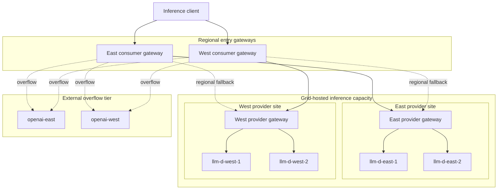
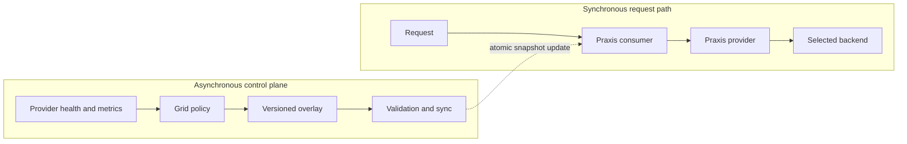
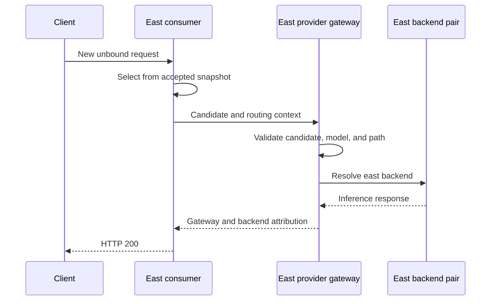
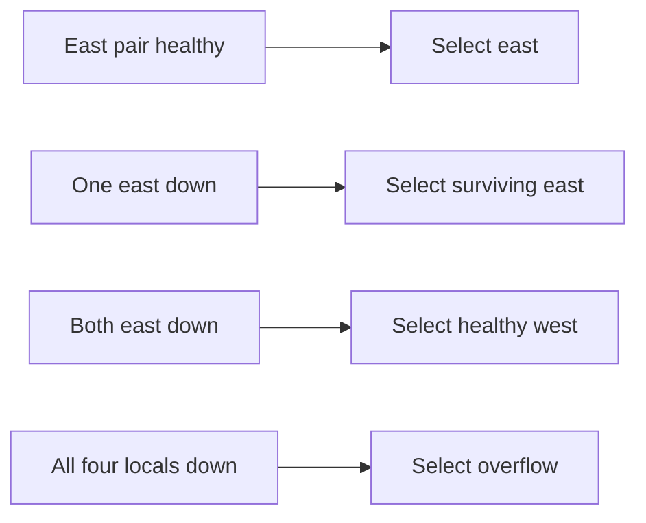
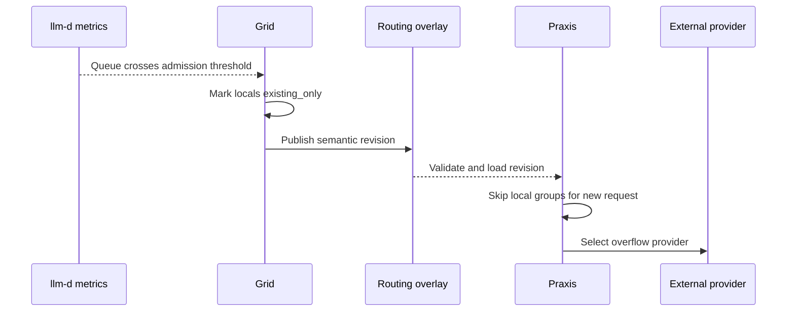

<!-- markdownlint-disable MD013 MD025 MD033 MD060 -->

# Grid Regional Failover and Cloud Burst

https://github.com/user-attachments/assets/6cb33a69-288d-4195-8f80-c6bc537f2d41

This experimental demo shows inference traffic moving through four local
providers in two provider sites and two external overflow routes. It covers
healthy site-local balancing, backend failure, cross-site fallback, pressure-driven
admission, cloud overflow, recovery, and request-level provider attribution.

The implementation is early work in progress. Required changes are still
carried on development branches while their upstream contracts are reviewed.
Configuration and deployment may change as those proposals settle. Recreating
the environment currently requires manual assembly and familiarity with
Kubernetes, Grid, and Praxis.

## What this demo proves

| Capability | Demonstrated behavior |
|---|---|
| Regional balancing | East traffic uses `llm-d-east-1/2`; west uses `llm-d-west-1/2`. |
| Single-backend failure | Traffic stays site-local and uses the surviving backend. |
| Provider-site failure | Traffic uses healthy Grid providers in the other site. |
| Full Grid failure | Traffic uses `openai-east` and `openai-west`. |
| Pressure admission | Queue pressure moves locals to `existing_only`; new traffic uses overflow. |
| Recovery | Recovered locals rejoin after Grid publishes and Praxis accepts new state. |
| Exact attribution | Request paths distinguish the provider gateway from its selected backend. |
| Hot-path isolation | Grid publishes state asynchronously; Praxis selects from a local snapshot. |

The demo does not claim gradual percentage-based cloud bursting, cost-aware
placement, billing, or token-quota enforcement. Its cloud transition is group
fallback: external capacity becomes active when no preferred Grid provider can
accept a new request.

## Topology

Two consumer gateways can reach two provider sites. Each provider
site has a provider gateway and two local inference simulators. Two external
routes form the final overflow tier.



The local providers use
[`llm-d-inference-sim`](https://github.com/llm-d/llm-d-inference-sim) to expose
an OpenAI-compatible endpoint and Prometheus-compatible pressure signals. It
stands in for an inference stack. Grid does not manage model serving,
scheduling, or inference-engine internals.

## Component ownership

| Component | Responsibility | Not its request-time responsibility |
|---|---|---|
| Grid operator | Observe health and llm-d-compatible metrics, compute admission and locality groups, publish versioned overlays. | Proxy inference requests or select a destination per request. |
| Overlay sync | Validate and deliver accepted routing state to Praxis. | Score providers or run inference. |
| Praxis consumer | Parse the request, read the accepted snapshot, select a viable provider, forward the request. | Query Kubernetes, Grid, EPP, or Prometheus per request. |
| Praxis provider | Validate candidate/model/path, resolve a provider-local backend, apply final-hop credentials. | Recompute Grid placement. |
| llm-d stack | Manage provider-local inference scheduling and expose operational signals. | Compute Grid-wide locality or overflow policy. |
| External provider | Serve eligible overflow requests. | Participate in Grid's synchronous control path. |



Grid reconciles at its own cadence. Praxis continues serving from the last
accepted snapshot and switches only after a newer snapshot has been validated
and loaded.

## Routing order

For a request entering the east consumer:

| Priority | Candidate tier | Used when |
|---:|---|---|
| 1 | Healthy east providers | Normal local operation. |
| 2 | Healthy west providers | East has no provider eligible for new traffic. |
| 3 | External overflow | No Grid provider is eligible, or admission restricts all locals. |

The west consumer uses the same order with west and east reversed. Disabling
both east backends should not immediately use an external API while healthy
west capacity remains eligible. Cloud is the final viable group.

### Healthy request



### Availability fallback



### Pressure fallback

Queue depth is collected from each configured llm-d-compatible metrics
endpoint. With capacity 10, the validated scenario set the queue to 9. That
crossed the admission boundary and moved all local providers to
`existing_only` for new requests.



`existing_only` can preserve an established binding where policy permits it,
but prevents a new unbound selection. It differs from a fully excluded or
unhealthy provider.

## Exact request attribution

| Field | Example | Meaning |
|---|---|---|
| Provider gateway | `east` | Provider security and routing boundary. |
| Inference provider | `llm-d-east-1` | Provider-local backend resolved by `provider_route`. |

With optional response attribution enabled, the gateway returns both values:

```http
x-ai-demo-provider-gateway: east
x-ai-inference-provider: llm-d-east-1
```

The inference-provider value comes only from trusted `provider_route.cluster`
metadata after candidate, model, and path validation. A client-provided header
with that name is removed and cannot override the selected backend.

The corresponding OpenTelemetry span is `provider.route`, with bounded
provider, backend, model, candidate, and optional overlay-revision attributes.
Praxis core still owns propagation, sampling, request spans, and OTLP export.

## Representative configuration

These fragments explain the contract. Use the complete resources in
[`example-manifests`](./example-manifests/) as the source for these examples.

### Grid policy

```yaml
gridNetwork:
  name: grid-cloud-burst-rhoai
  routingPolicy: geographyFirst
  scoringPolicy:
    strategy: queueDepth
  selectionPolicy:
    mode: roundRobin
    grouping:
      localityScope: sameSite
```

- `geographyFirst` keeps the closest viable providers first.
- `queueDepth` uses the configured llm-d-compatible signal for scoring and
  admission.
- `roundRobin` distributes new unbound requests inside the active group.
- `sameSite` keeps each local pair in its site-local group.

### Local provider

```yaml
apiVersion: grid.praxis-proxy.io/v1alpha1
kind: InferenceProvider
metadata:
  name: llm-d-east-1
  namespace: grid-system
spec:
  gridNetworkRef: grid-cloud-burst-rhoai
  providerKind: llm-d-inference-sim
  backendKind: local
  endpoint: http://llm-d-east-1.grid-system.svc.cluster.local:8000
  routingClusterRef: llm-d-east-1
  models:
    - name: gpt-4o-mini
      capabilities: [text_generation]
      contextWindow: 4096
  siteSelector:
    matchLabels:
      grid.praxis-proxy.io/provider-site: east-local
  metricsConfig:
    metricsEndpoint: http://llm-d-east-1.grid-system.svc.cluster.local:8000
    path: /metrics
    queueCapacity: 10
    signalNames:
      queueDepth: vllm:num_requests_waiting
    timeout: 2s
  healthCheck:
    path: /health
    interval: 5s
    timeout: 2s
```

The provider name, `routingClusterRef`, provider-gateway route, Service, and
Deployment must agree so attribution names the actual selected backend.

### External overflow provider

```yaml
apiVersion: grid.praxis-proxy.io/v1alpha1
kind: InferenceProvider
metadata:
  name: openai-east
  namespace: grid-system
spec:
  gridNetworkRef: grid-cloud-burst-rhoai
  providerKind: openai
  backendKind: api_provider
  endpoint: https://api.openai.com
  routingClusterRef: openai-east
  models:
    - name: gpt-4o-mini
      capabilities: [text_generation]
      contextWindow: 4096
  auth:
    strategy: bearer_token
    manual: true
    secretRef:
      name: openai-api-key
      namespace: grid-system
      key: token
```

The credential belongs at the provider boundary. It must not appear in Grid
routing metadata, response attribution, logs, or trace attributes.

### External cluster

Praxis must set both TLS SNI and HTTP authority:

```yaml
- name: openai-east
  http:
    authority: api.openai.com
  endpoints:
    - api.openai.com:443
  tls:
    sni: api.openai.com
    verify: true
  idle_timeout_ms: 5000
```

`authority` is nested under `http`. SNI alone can produce HTTP 421 even when
TLS succeeds. The idle timeout avoids reusing a connection after the upstream
has closed it. Do not use unauthenticated `/v1/models` as a health probe for a
credentialed route; a 401 would incorrectly mark a usable provider unhealthy.

## Example resources

| File | Purpose |
|---|---|
| [`08-regional-local-pools.yaml`](./example-manifests/08-regional-local-pools.yaml) | Four simulator ConfigMaps, Deployments, and Services. |
| [`09-regional-inference-providers.yaml`](./example-manifests/09-regional-inference-providers.yaml) | Four local providers with health and queue metrics. |
| [`10-openai-overflow-providers.yaml`](./example-manifests/10-openai-overflow-providers.yaml) | Two external overflow providers. |
| [`10-observability-jaeger.yaml`](./example-manifests/10-observability-jaeger.yaml) | Optional OTLP-compatible Jaeger deployment. |
| [`configure-otel.sh`](./scripts/configure-otel.sh) | Configures gateway OTLP export. |
| [`configure-ui-traces.sh`](./scripts/configure-ui-traces.sh) | Connects the UI to trace queries. |

These extend an existing Grid and Praxis environment. They do not create the
complete cluster, trust material, gateways, overlay sync, routes, or external
credentials by themselves.

## Deployment outline

### Prerequisites

- Kubernetes or OpenShift.
- Grid operator and overlay sync from the development branch below.
- Praxis gateways built with the corresponding AI routing changes.
- `kubectl` or `oc`, Helm, and permission to create Grid resources.
- An external API credential if real overflow is exercised.
- Optional OTLP, Jaeger, and the routing UI.

Install the base Grid and Praxis components, establish consumer-to-provider
trust, and confirm gateway readiness. Create `grid-system/openai-api-key` with
a `token` entry through normal secret management; never commit it here.

Apply the reusable provider resources:

```bash
kubectl apply -f example-manifests/08-regional-local-pools.yaml
kubectl apply -f example-manifests/09-regional-inference-providers.yaml
kubectl apply -f example-manifests/10-openai-overflow-providers.yaml
```

Configure provider gateways with route and cluster names matching the six
`routingClusterRef` values. Wait until Grid health and admission converge, then
confirm the published overlay revision matches the revision served by Praxis.

Optional tracing:

```bash
kubectl apply -f example-manifests/10-observability-jaeger.yaml
./scripts/configure-otel.sh
./scripts/configure-ui-traces.sh
```

Review the scripts first; they assume names from this development environment.

## Validation matrix

Use unique request/session IDs and clear UI history before each phase. Wait for
Kubernetes state, provider health, overlay publication, and Praxis serving
revision convergence before measuring traffic.

| Scenario | Action | Expected result |
|---|---|---|
| Healthy east | 20 unbound east requests. | Both east providers appear. |
| Healthy west | 20 unbound west requests. | Both west providers appear. |
| One east down | Scale `llm-d-east-1` to zero. | All new traffic uses `llm-d-east-2`. |
| East down | Scale both east simulators to zero. | Traffic uses west, not cloud. |
| One west down | Scale `llm-d-west-1` to zero. | All new traffic uses `llm-d-west-2`. |
| West down | Scale both west simulators to zero. | Traffic uses east, not cloud. |
| All locals down | Scale all four simulators to zero. | Traffic uses both OpenAI routes. |
| Queue pressure | Put all local queues over admission. | New traffic uses overflow. |
| Recovery | Restore replicas/queues and wait. | Traffic returns to its preferred site-local group. |

Example failure injection:

```bash
kubectl -n grid-system scale deployment llm-d-east-1 --replicas=0
```

Always restore the environment:

```bash
kubectl -n grid-system scale deployment llm-d-east-1 llm-d-east-2 llm-d-west-1 llm-d-west-2 --replicas=1
```

Do not treat retries alone as convergence proof. State, overlay revision,
Praxis serving revision, HTTP status, response headers, and UI path must agree.

## Qualified results

| Scenario | Result | Selected inference providers |
|---|---:|---|
| Healthy east | 20/20 HTTP 200 | `llm-d-east-1`: 8, `llm-d-east-2`: 12 |
| Healthy west | 20/20 HTTP 200 | `llm-d-west-1`: 7, `llm-d-west-2`: 13 |
| One east disabled | 10/10 HTTP 200 | `llm-d-east-2`: 10 |
| Both east disabled | 10/10 HTTP 200 | `llm-d-west-1`: 3, `llm-d-west-2`: 7 |
| One west disabled | 4/4 HTTP 200 | `llm-d-west-2`: 4 |
| Both west disabled | 4/4 HTTP 200 | `llm-d-east-1`: 3, `llm-d-east-2`: 1 |
| All four disabled | 6/6 HTTP 200 | openai-west: 5, openai-east: 1 |
| Queue at 9/10 | HTTP 200 via overflow | openai-east and openai-west |
| Pressure recovery | HTTP 200 via local | `llm-d-east-1` and `llm-d-east-2` |
| Final 2 requests/sec | 10/10 HTTP 200 | zero 502 responses |

The full names shown by the UI were `llm-d-east-1`, `llm-d-east-2`,
`llm-d-west-1`, `llm-d-west-2`, `openai-east`, and `openai-west`. A direct
header check separately reported gateway `east` and backend `llm-d-east-1`.
All simulator Deployments were restored to `1/1`, queues returned to zero, and
no recent 403, 421, 502, or 503 gateway errors remained.

The counts prove participation and fallback, not a statistical service-level
guarantee. Round-robin state is local to each Praxis process; aggregate traffic
converges with sufficient unbound volume.

## Security and limitations

- Provider credentials remain in Secrets and are injected only at the final
  provider hop.
- Client backend-attribution headers are removed before forwarding.
- Prompts, responses, credentials, authorization headers, and raw session IDs
  are not default trace attributes.
- External API traffic can incur cost. Bound traffic and rotate temporary
  credentials.
- This is not a supported release bundle or one-command installer.
- Simulator pressure is not production qualification of every llm-d/EPP or
  inference-engine metric contract.
- The demo proves hard group fallback, not gradual weighted spillover.
- A `provider.route` span records a routing decision, not downstream completion.

## Development inputs

| Component | Repository and branch | Role |
|---|---|---|
| Praxis core | [`nerdalert/praxis:burst-routing-v1`](https://github.com/nerdalert/praxis/tree/burst-routing-v1) | Proxy/runtime and trusted identity. |
| Praxis AI | [`nerdalert/ai:burst-routing-v1-running`](https://github.com/nerdalert/ai/tree/burst-routing-v1-running) | Selection, provider routing, model rewrite, credentials, attribution. |
| Grid | [`nerdalert/grid:burst-routing-v1-running`](https://github.com/nerdalert/grid/tree/burst-routing-v1-running) | Health, admission, grouping, and overlay publication. |
| Experimental | [`nerdalert/experimental:grid-cloud-burst`](https://github.com/nerdalert/experimental/tree/grid-cloud-burst/demos/grid-cloud-burst) | Documentation and example resources. |

Related upstream work:

- [AI provider selection foundation](https://github.com/praxis-proxy/ai/pull/731)
- [Grid provider selection groups](https://github.com/praxis-proxy/grid/pull/65)
- [AI provider-backend attribution](https://github.com/praxis-proxy/ai/pull/834)

## Summary

```text
healthy local pair
  -> surviving local backend
  -> healthy providers in the other site
  -> external overflow when Grid capacity is unavailable or restricted
  -> local capacity after recovery
```

Grid computes and publishes policy asynchronously. Praxis executes the
accepted snapshot locally and reports the exact gateway and inference backend
selected for each request.

<!-- markdownlint-enable MD013 MD025 MD033 MD060 -->
