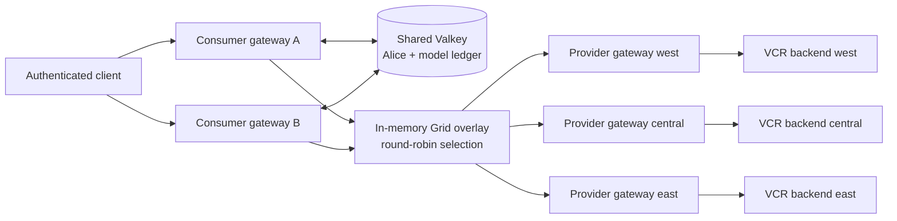
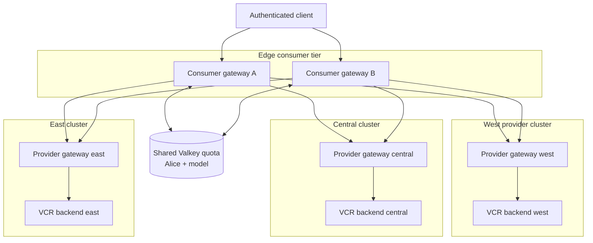
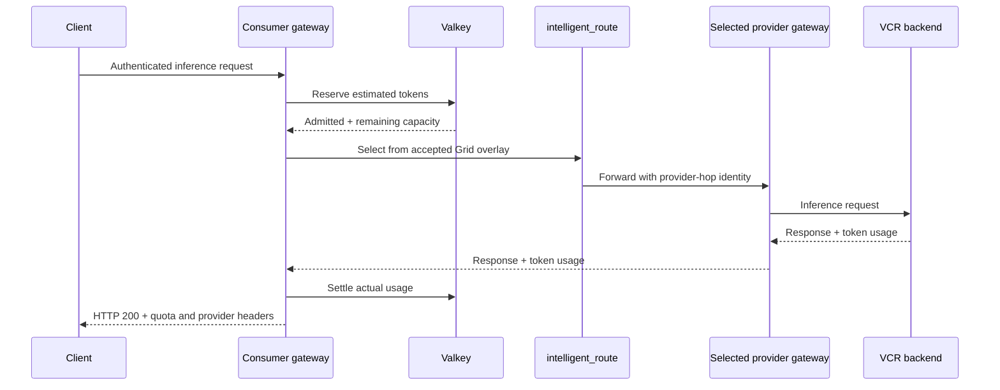
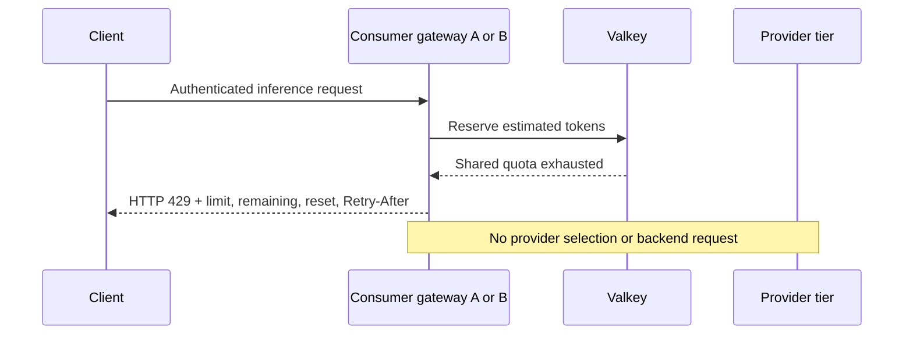

# Distributed token rate limiting with Grid routing

This experimental demo combines authenticated token quotas with provider-level
Grid routing. Two independent consumer gateways enforce one shared quota for
Alice and a model through Valkey. Requests admitted by the quota layer are then
distributed across three provider gateways by the Grid-provided round-robin
selection contract.

> [!IMPORTANT]
> This is early exploratory work intended to validate the architecture and
> inform the proposals that will define the upstream implementation. The demo
> assembles development versions of capabilities spanning Praxis, Praxis AI,
> Grid, and supporting observability components. Its branches and images provide
> a reproducible integration snapshot, not the final upstream design or a stable
> deployment contract. Configuration, APIs, ownership boundaries, and runtime
> behavior are expected to evolve as the proposals are reviewed and the work is
> implemented in the appropriate upstream components.
>
> Expect the deployment to require some hands-on troubleshooting. Several
> components and their integration contracts are still carried on out-of-tree
> development branches rather than coordinated releases.

<!-- markdownlint-disable-next-line MD034 -->
https://github.com/user-attachments/assets/7d72e292-8183-4a25-aadb-995c9578efb4

## What this demonstrates

- Basic authentication publishes a trusted `identity.user_id` only after the
  credentials have been verified.
- A shared Valkey ledger lets a horizontally scaled fleet of consumer gateways
  enforce one Alice/model quota instead of multiplying the quota per replica.
- An admitted request is routed to the west, central, or east provider gateway.
- Provider selection rotates across the active Grid group without calling Grid
  or Valkey for the routing decision.
- Once the shared 60-token window is exhausted, either consumer returns HTTP
  `429` before a provider is contacted.
- Capacity returns incrementally as entries age out of the sliding window.
- A Valkey outage fails closed with HTTP `503` rather than bypassing the quota.

## Implementation highlights

- **Authentication produces the quota identity.** Basic Auth publishes the
  principal only after successful credential verification. The limiter consumes
  generic identity metadata, leaving room for JWT/OIDC to provide the same
  contract later.
- **Quotas follow users, not gateway replicas.** The key combines the trusted
  principal and requested model. Atomic Valkey operations give horizontally
  scaled gateways one shared view of reservations and settled usage.
- **Admission happens before routing.** Rejected traffic returns `429` without
  selecting a provider, opening a provider connection, or consuming inference
  capacity.
- **Reservations become actual usage.** Praxis reserves an estimate before the
  request and reconciles it with reported token usage afterward. Unused capacity
  can be refunded, while overages are charged conservatively and settlement is
  idempotent.
- **Routing changes do not reset quota.** Grid can move or distribute admitted
  traffic across provider gateways while the user/model ledger remains stable in
  Valkey.
- **Failure behavior is explicit.** The shared backend is bounded, reservations
  expire, and an unavailable Valkey backend fails closed with `503` rather than
  silently granting untracked capacity.
- **The request path stays locally routable.** Grid computes and publishes the
  provider overlay asynchronously. Praxis selects from its accepted in-memory
  snapshot after quota admission instead of calling the Grid control plane.

## Architecture



The responsibilities are intentionally separate:

| Component | Responsibility |
| --- | --- |
| Praxis authentication | Verify credentials and publish the authenticated principal. |
| Praxis AI quota filter | Reserve and settle tokens against the shared Valkey ledger. |
| Grid operator | Publish eligible providers, group boundaries, and round-robin selection mode. |
| Praxis AI routing filter | Select a provider locally from the accepted overlay snapshot. |
| Provider gateway and VCR | Enforce the provider boundary and serve the inference request. |

Grid does not store quota state or enforce token limits. Valkey is not involved
in provider selection. These boundaries keep quota policy and control-plane work
outside provider routing while still allowing admitted traffic to use Grid.
Because quota reservations are stored in Valkey, any gateway configured with the
same backend, namespace, and policy can enforce the same logical quota. Adding or
restarting a gateway does not create a fresh allowance for that principal.

## Topology

The logical topology is a pyramid. Two independently addressable edge consumer
gateways sit above one shared quota ledger and route admitted requests into a
three-cluster provider tier. Each provider cluster contains one provider gateway
and one VCR-backed inference workload.



The two consumer gateways demonstrate that the quota survives process boundaries
and consumer restarts. The same design can extend across a horizontally scaled
fleet of gateway replicas. Their round-robin counters are intentionally local,
so the demo claims aggregate distribution across providers, not one globally
synchronized sequence shared by all consumers.

### Request sequences

An admitted request reserves quota before provider selection. Grid has already
published the provider set and selection mode, so Praxis selects locally from
its in-memory overlay.



When the shared window is exhausted, the request stops at quota admission. It
does not enter routing and cannot contact a provider or backend.



## Prerequisites

- Linux with Docker
- Kind, `kubectl`, and Helm
- Rust toolchain compatible with the Grid branch
- Git and `curl`
- At least 16 GiB of available memory for three Kind clusters

Confirm the local tools before deployment:

```bash
docker info
kind version
kubectl version --client
helm version
cargo --version
```

## Check out the stacked upstream work

Use the open upstream PRs rather than contributor branches or personal registry
defaults:

```bash
git clone https://github.com/praxis-proxy/grid.git grid
git -C grid fetch origin pull/65/head:refs/remotes/origin/pr-65 pull/84/head:refs/remotes/origin/pr-84
git -C grid switch --detach origin/pr-84

git clone https://github.com/praxis-proxy/ai.git ai
git -C ai fetch origin pull/731/head:refs/remotes/origin/pr-731 pull/790/head:refs/remotes/origin/pr-790
git -C ai switch --detach origin/pr-790

git clone https://github.com/praxis-proxy/praxis.git praxis
git -C praxis fetch origin pull/1011/head:refs/remotes/origin/pr-1011
git -C praxis switch --detach origin/pr-1011
```

Builds from these checkouts are local validation artifacts. Do not push them
to a registry until the cold deployment and runtime proof pass.

The Grid topology contains two consumers, three VCR-backed providers, and one
private Valkey service. It does not deploy the tracing stack; run the tracing UI
as a separate optional application.

Inspect readiness and the three-candidate overlays:

```bash
kind get clusters
kubectl --context kind-grid-token-rate-limit-west -n grid-system get deploy,pods
kubectl --context kind-grid-token-rate-limit-west -n grid-system get configmap -l app.kubernetes.io/part-of=grid
```

The topology contains the consumer credentials and test quota configuration.
They are demonstration fixtures only and must not be reused in another
environment.

## Build and deploy on Kind

Build the combined AI gateway, Grid operator, and overlay-sync images from the
checked-out PR sources. Keep the image names local and use `Never` pull policy:

<!-- markdownlint-disable MD013 -->
```bash
export GATEWAY_IMAGE=praxis-ai:distributed-token-quota-local
export OPERATOR_IMAGE=grid-operator:distributed-token-quota-local
export OVERLAY_SYNC_IMAGE=grid-overlay-sync:distributed-token-quota-local
export GRID_XTASK_GATEWAY_IMAGE="$GATEWAY_IMAGE"
export GRID_XTASK_OPERATOR_IMAGE="$OPERATOR_IMAGE"
export GRID_XTASK_OVERLAY_SYNC_IMAGE="$OVERLAY_SYNC_IMAGE"
export GRID_XTASK_IMAGE_PULL_POLICY=Never

docker build -f ai/Containerfile -t "$GATEWAY_IMAGE" ai
docker build -f grid/deploy/operator/Containerfile -t "$OPERATOR_IMAGE" grid
docker build -f grid/overlay-sync/Containerfile -t "$OVERLAY_SYNC_IMAGE" grid
```
<!-- markdownlint-enable MD013 -->

### Option: pre-built images

You may use pre-built images instead of building locally. Supply the exact
references you intend to validate; do not rely on the organization defaults to
contain the unmerged quota changes:

```bash
export GRID_XTASK_GATEWAY_IMAGE=registry.example/praxis-ai:quota-validation
export GRID_XTASK_OPERATOR_IMAGE=registry.example/grid-operator:quota-validation
export GRID_XTASK_OVERLAY_SYNC_IMAGE=registry.example/grid-overlay-sync:quota-validation
export GRID_XTASK_IMAGE_PULL_POLICY=IfNotPresent
```

With `IfNotPresent`, skip the `kind load docker-image` commands below. Forge
will render those explicit references and Kubernetes will pull them. Continue
with the same materialization, cluster creation, and phased stack-application
commands. Record the image digests before treating the run as qualifying.

Forge does not consume `GRID_XTASK_*` variables directly. Materialize a
resolved Forge file first; this replaces the image properties in every cluster
while preserving the checked-in topology. The command fails if local pull mode
is selected without all three local Grid images:

<!-- markdownlint-disable MD013 -->
```bash
CONFIG=tests/e2e/topologies/grid-token-rate-limit/forge.yaml
RESOLVED_CONFIG=tests/e2e/topologies/grid-token-rate-limit/forge.resolved.yaml
cargo run -p xtask -- env materialize-forge-config --forge-config "$CONFIG" --output "$RESOLVED_CONFIG"

for cluster in west central east; do
  cargo run -p forge -- --config "$RESOLVED_CONFIG" cluster create "$cluster"
  kind load docker-image "$GATEWAY_IMAGE" --name "grid-token-rate-limit-$cluster"
  kind load docker-image "$OPERATOR_IMAGE" --name "grid-token-rate-limit-$cluster"
  kind load docker-image "$OVERLAY_SYNC_IMAGE" --name "grid-token-rate-limit-$cluster"
done
cargo run -p forge -- --config "$RESOLVED_CONFIG" up

# `forge up` creates the Docker network and Kind clusters. Apply the
# Kubernetes stacks explicitly. The operator bootstrap is two-pass: the first
# pass captures each local SWIM LoadBalancer address; the second pass can then
# resolve the other two clusters' captured addresses.
for cluster in west central east; do
  cargo run -p forge -- --config "$RESOLVED_CONFIG" --state-dir .forge stack apply "$cluster" "${cluster}-operator-base"
done
for cluster in west central east; do
  cargo run -p forge -- --config "$RESOLVED_CONFIG" --state-dir .forge stack apply "$cluster" "${cluster}-operator-seed"
done

# Apply the remaining stacks in dependency order after the operator mesh is
# seeded. Keeping these phases explicit avoids applying a consumer before its
# provider, trust, and overlay dependencies are ready.
for cluster in west central east; do
  cargo run -p forge -- --config "$RESOLVED_CONFIG" --state-dir .forge stack apply "$cluster" vcr-backend
done
for cluster in west central east; do
  cargo run -p forge -- --config "$RESOLVED_CONFIG" --state-dir .forge stack apply "$cluster" provider-boundary
done
for cluster in west central east; do
  cargo run -p forge -- --config "$RESOLVED_CONFIG" --state-dir .forge stack apply "$cluster" provider-gateway
done
for cluster in west central east; do
  cargo run -p forge -- --config "$RESOLVED_CONFIG" --state-dir .forge stack apply "$cluster" "${cluster}-trust-bootstrap"
done
for cluster in west central east; do
  cargo run -p forge -- --config "$RESOLVED_CONFIG" --state-dir .forge stack apply "$cluster" "${cluster}-site"
done
for cluster in west central east; do
  cargo run -p forge -- --config "$RESOLVED_CONFIG" --state-dir .forge stack apply "$cluster" site-trust-bootstrap
done
cargo run -p forge -- --config "$RESOLVED_CONFIG" --state-dir .forge stack apply west valkey
for stack in consumer-west-a consumer-west-b; do
  cargo run -p forge -- --config "$RESOLVED_CONFIG" --state-dir .forge stack apply west "$stack"
done
```
<!-- markdownlint-enable MD013 -->

The resolved file is generated output and must not be committed. Verify the
actual rendered image values before deployment:

```bash
grep -nE 'gatewayImage|operatorImage|overlaySyncImage|imagePullPolicy' "$RESOLVED_CONFIG"
cargo run -p forge -- --config "$RESOLVED_CONFIG" config validate
```

After the pods start, verify their image references and immutable image IDs:

```bash
for context in west central east; do
  kubectl --context "kind-grid-token-rate-limit-$context" -n grid-system \
    get pods -o custom-columns='NAME:.metadata.name,IMAGE:.spec.containers[*].image,IMAGE_ID:.status.containerStatuses[*].imageID'
done
```

## Validate the request flow

Forward the two consumer services in separate terminals:

```bash
kubectl --context kind-grid-token-rate-limit-west -n grid-system port-forward svc/consumer-gateway-a 18080:8080
kubectl --context kind-grid-token-rate-limit-west -n grid-system port-forward svc/consumer-gateway-b 18081:8080
```

Send requests as Alice through both entries. Use the Basic Auth password from
the west consumer fixture in the checked-out topology:

```bash
for port in 18080 18081 18080 18081; do
  curl -i -u 'alice:alice-secret' -H 'Content-Type: application/json' \
    -H 'X-Model: Qwen/Qwen3-0.6B' -X POST \
    "http://127.0.0.1:${port}/v1/chat/completions" \
    -d '{"model":"Qwen/Qwen3-0.6B","messages":[{"role":"user","content":"Explain quorum."}],"max_tokens":15}'
done
```

For admitted requests, inspect the provider-attribution and rate-limit headers.
After the shared 60-token window is consumed, the next request through either
consumer must return `429`, include limit/remaining/reset information, and omit
provider attribution. Waiting for entries to age out restores capacity
incrementally; this is sliding-window recovery, not a global reset.

## Optional tracing UI

The Grid quota topology does not include Collector, Jaeger, or a tracing UI.
Run the modular tracing application separately and enable its distributed-quota
profile with `TRACING_UI_TOKEN_RATE_LIMIT=true`, both consumer URLs, and a
server-side password file. The UI is a presentation surface; quota evidence
must still come from HTTP responses, Valkey, provider counts, and Grid overlay
inspection.

## Teardown

```bash
cargo run -p forge -- --config "$RESOLVED_CONFIG" down
```

Verify cleanup:

```bash
kind get clusters
docker network ls --filter name=grid-token-rate-limit
```

## Current scope

This is experimental code. It demonstrates an exact shared sliding-window
ledger on one private Valkey instance, fail-closed backend behavior, and local
provider selection from immutable Grid overlays. It does not claim Valkey high
availability, multi-region quota storage, dynamic policy administration, or a
globally synchronized round-robin counter.

JWT/OIDC authentication is pending. Basic Auth is used here as a small,
auditable producer of the same authenticated-principal metadata contract that a
future JWT/OIDC filter can populate. The quota filter is keyed by that generic
identity metadata rather than by Basic Auth-specific fields.

## Related work

- [Canonical token-rate-limit proposal](https://github.com/praxis-proxy/ai/pull/658)
- [Provider selection in Praxis AI](https://github.com/praxis-proxy/ai/pull/731)
- [Provider selection contract in Grid](https://github.com/praxis-proxy/grid/pull/65)
- [Basic authentication in Praxis](https://github.com/praxis-proxy/praxis/pull/824)
- [Authenticated-principal implementation](https://github.com/praxis-proxy/praxis/pull/1011)
- [Distributed quota implementation](https://github.com/praxis-proxy/ai/pull/790)
- [Grid quota topology](https://github.com/praxis-proxy/grid/pull/84)
- [Provider-selection foundation](https://github.com/praxis-proxy/ai/pull/731)
- [Grid selection contract](https://github.com/praxis-proxy/grid/pull/65)
